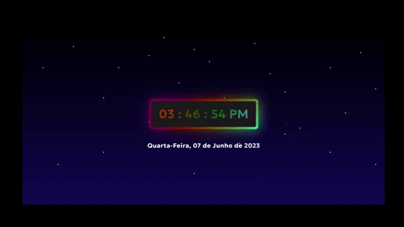

# Relógio ⏰📅

Este projeto consiste em um relógio digital que exibe a hora exata, juntamente com informações da data local. Com este projeto, você poderá aprender e aprimorar suas habilidades de desenvolvimento web utilizando HTML, CSS e JavaScript.

## Funcionalidades 🎯

* Exibição da hora atual em formato 12 horas (AM/PM).
* Exibição da data atual com dia, mês e ano.

## GIF demonstrativo 🎥

